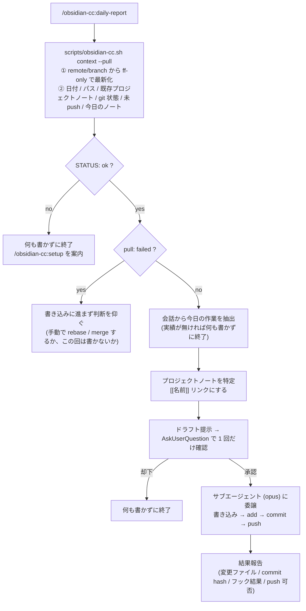

# obsidian-cc

Claude Code のセッションでやった作業を、Obsidian vault のデイリーノートに日報として書き込み、commit して push する plugin。

vault の場所は**設定ファイルで指定する**ので、どのマシン・どの vault 構成でも動く。

## 構成

- **skill `daily-report`** — vault を最新化 → 会話から今日の作業を抽出 → ドラフト提示 → 承認 → 書き込み・commit・push (書き込みはサブエージェントに委譲)
- **command `/obsidian-cc:setup`** — vault の設定 (`~/.claude/obsidian-cc.json`) を対話で作成・検証する
- **`scripts/obsidian-cc.sh`** — 設定の検証・書き込みと実行時コンテキスト収集を担うヘルパー (skill / command はこれ以外の方法で設定に触らない)

## インストール

```
/plugin marketplace add taichi0529/plugins-cc
/plugin install obsidian-cc@taichi0529
```

インストール後に 1 回だけ:

```
/obsidian-cc:setup
```

`~` 配下から `.obsidian` ディレクトリを探して vault の候補を出し、git リポジトリルートを特定して設定ファイルを書く。パスが分かっているなら直接渡してもよい:

```
/obsidian-cc:setup /Users/you/work/Obsidian
```

## 使い方

```
/obsidian-cc:daily-report
/obsidian-cc:daily-report 午後は障害対応で潰れた
```

引数は任意の補足。会話から拾えない事情を足したいときに使う。



## 設定ファイル: `~/.claude/obsidian-cc.json`

`/obsidian-cc:setup` が書く。手で書いてもよいが、その場合も `scripts/obsidian-cc.sh check` で検証すること。

```json
{
  "repoRoot": "/Users/you/work/Obsidian",
  "vaultDir": "/Users/you/work/Obsidian/notes",
  "remote": "origin",
  "branch": "main",
  "projectTag": "project"
}
```

| キー | 必須 | 既定 | 意味 |
|---|---|---|---|
| `repoRoot` | ✅ | — | vault を管理している git リポジトリのルート (絶対パス)。すべての git コマンドの `-C` に渡る |
| `vaultDir` | | `repoRoot` | デイリーノート / プロジェクトノートの置き場。**`repoRoot` 配下必須** |
| `remote` | | `origin` | push 先リモート |
| `branch` | | `main` | push 先ブランチ |
| `projectTag` | | `project` | プロジェクトノートを識別する frontmatter の tag |

パスは `$OBSIDIAN_CC_CONFIG` で変更できる (テスト用)。

### 検証の内容

`check` / `write` は次を全部確認する。1 つでも落ちたら `write` は設定ファイルを書かない。

- `repoRoot` が絶対パスで存在し、その場所が git リポジトリの**ルート**であること
- `vaultDir` が存在し、`repoRoot` 配下であること (外だと commit できない)
- `remote` / `branch` がリポジトリに実在すること
- `projectTag` が英数字と `_ - /` だけであること

## 書き込みの規約

- デイリーノートのファイル名は `YYYY-MM-DD.md` 固定 (Obsidian の Bases が `/^\d{4}-\d{2}-\d{2}$/` で拾う前提)。既存なら追記、無ければ frontmatter 付きで新規作成
- プロジェクトノートは**追記のみ**。既存行・表・callout・チェックボックスは書き換えない (必要なら提案して承認を取る)
- commit メッセージは日本語

## 起動時の最新化 (v0.2.0)

skill はコンテキストを読む**前**に `<remote>/<branch>` から最新化する (`context --pull`)。別マシンや Obsidian Sync で先に更新された日報を、古い状態のまま上書き追記しないため。

- **fast-forward に限定**する (`fetch` → `merge --ff-only`)。merge コミットを作らず、履歴も書き換えない
- 失敗しても中断せず、理由を `pull:` 行に出して skill 側に判断させる

| `pull:` の値 | 意味 | skill の動き |
|---|---|---|
| `up-to-date (<sha>)` | 既に最新 | そのまま進む |
| `fast-forwarded <old>..<new>` | 最新化した | そのまま進む |
| `skipped (detached HEAD)` / `skipped (現在のブランチ … が異なる)` | pull すべきでない状態 | 理由を報告してから進む |
| `failed (ローカルとリモートが分岐している …)` | ff できない | **書き込みに進まず判断を仰ぐ** |
| `failed (… 未コミット変更が更新対象と衝突している)` | ff できない | 同上 |
| `failed (… fetch できない …)` | ネットワーク / 認証 | 同上 |

あわせてコンテキストに**未 push のコミット**を列挙する。`git push` はブランチ全体を送るので、日報の push に他のコミットが便乗する。承認前にその事実を提示するための情報。

## 安全設計

このスキルは**どのプロジェクトのセッションからでも呼ばれる**。カレントディレクトリのリポジトリを誤って触らないよう、次を守っている。

- git コマンドは例外なく `git -C <repoRoot>`。`cd` による移動は禁止
- skill の `allowed-tools` は `Bash(git -C:*)`。`-C` の無い git コマンドはそもそもマッチしない
- `git add -A` / `git add .` 禁止 (触ったファイルだけ add する)
- `git commit --no-verify` 禁止。vault 側の pre-commit フック (gitleaks 等) が検出したら握り潰さず中断して報告する
- 書き込みは承認後にサブエージェントへ委譲。判断は本体セッションで終わらせ、サブエージェントは機械的な適用だけを行う

### git 許可ルール (任意)

`/obsidian-cc:setup` は最後に、`~/.claude/settings.json` へ次のルールを追加するか確認する (承認したときだけ書き、`settings.json.obsidian-cc.bak` にバックアップを取る)。

```
Bash(git -C /Users/you/work/Obsidian:*)
```

この vault だけに限定した許可なので、日報のたびに git の承認を求められなくなる一方、他リポジトリへの操作は許可されない。

## 依存

- `git`
- `jq` (無い場合はヘルパーがその旨を出して停止する)

## ローカル開発

```bash
claude --plugin-dir /path/to/plugins-cc/plugins/obsidian-cc
```

ヘルパー単体の確認:

```bash
OBSIDIAN_CC_CONFIG=/tmp/obs.json plugins/obsidian-cc/scripts/obsidian-cc.sh check
OBSIDIAN_CC_CONFIG=/tmp/obs.json plugins/obsidian-cc/scripts/obsidian-cc.sh context
```
