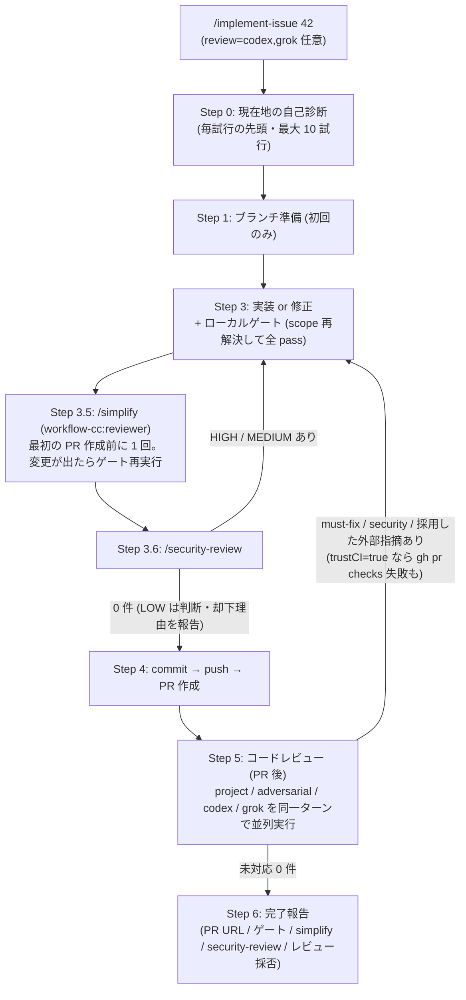
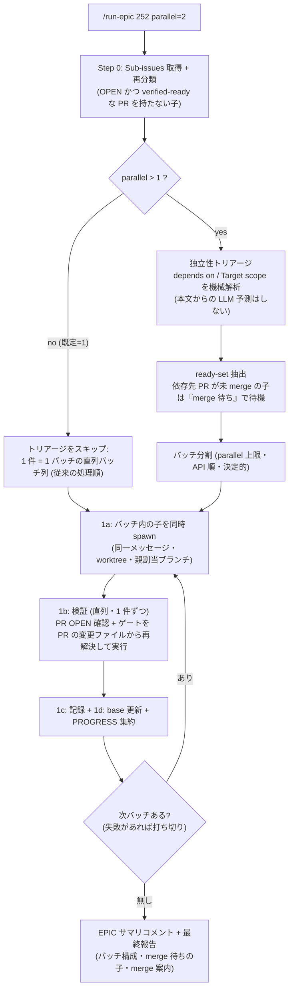
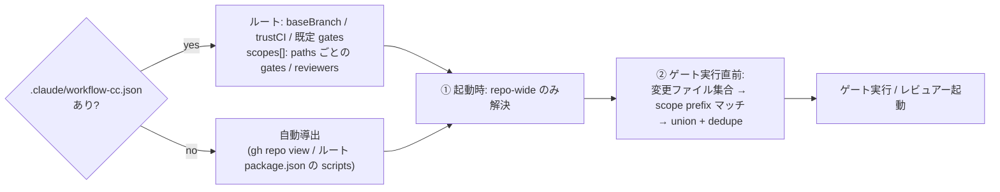

# workflow-cc

個人ワークフロー plugin。複数 issue 一括 + ループ実行ワークフローの汎用エンジン層。

## 構成

- **PROGRESS.md 永続化フック 3 本** (Phase 1・実装済み)
  - `SessionStart` — 「現在地」+ ログ直近 3 件をコンテキスト注入
  - `PostToolUse` (Bash) — `git commit` / `gh pr create` 検知で更新を強制 (主役)。ログ 10 件超の機械トリムも担当
  - `Stop` — バックストップ (HEAD が PROGRESS.md より新しければ block)
- **skills**
  - `implement-issue` (Phase 2) — Issue を内部ループ (最大 10 試行・自己診断式) で end-to-end 実装。リポジトリ非依存 (repo slug / ベースブランチ / ゲートを自動導出、`.claude/workflow-cc.json` で明示指定可 — path-scope 対応、後述)。PR 作成**前**に `/simplify` → `/security-review` (HIGH/MEDIUM 0 件必須) を実行。マルチレビュアー対応 (`review=codex,grok`) のレビューは PR 作成**後**で、既定は `project` + `adversarial` (red-team) + `grok` で、**並列にできるレビュー系は必ず並列起動**する。レビュー系実行体は `workflow-cc:reviewer` agent で動き、**既定は opus / effort high** (`review-model=<名>` でモデルだけ上書き可)
  - `run-epic` (Phase 3) — EPIC の OPEN な Sub-issues をオーケストレーション。**既定は直列**、`parallel=N` 指定時は依存宣言 (`depends on:` / `Target scope`) の機械解析で独立と判定できた子だけを wave 並列 (worktree モード限定)。子エージェントは `workflow-cc:implementer` agent で動き、**既定は opus / effort medium** (`model=<名>` でモデルだけ上書き可、`model=inherit` でセッション継承)、`review-model=<名>` は子が回すレビュー系のモデルとして子へパススルーされる。worktree 不成立環境 (ツールチェーンが docker のみ等) は main checkout 直列に自動フォールバック
  - `create-issue` (Phase 4) — PBI 形式の Issue 起票 (feature/bug/refactor/chore/epic/task テンプレ同梱)。依存 (`depends on:`) と `Target scope` の機械可読宣言を含む。DoD はリポジトリ側データ (設定ファイルの `dodFiles` → `.claude/dod/*.md` → 無ければ省略)

## implement-issue の実行フロー

各試行は Step 0 の自己診断から始まり、「次に必要な 1 歩」だけ進めてループ先頭へ戻る (最大 10 試行)。



- **Step 3.5 / 3.6 は最初の PR 作成前だけ** (PR 後の修正ループでは再実行しない — レビュー対応 diff を最小に保つ。ただしセキュリティに敏感な変更を加えた場合は 3.6 のみ再実行)。docs-only の変更や skill 不在時は skip して最終報告に明記 (fail-open)
- **security-review が PR 前・codex / grok が PR 後**なのは役割分担: 「push しても安全か」は push 前に担保し、品質の議論 (指摘の採否・却下理由) は PR コメントに投稿して人間が検証できるようにする。`trustCI` が true なら `gh pr checks` の失敗も Step 5 の修正ループで拾う
- 外部レビュアー (codex / grok) は GitHub を参照しない (実行環境から届かない罠が実測済み)。ローカル repo の `git diff <base>...<branch>` を読ませる — PR はタイミングであって diff の入力ではない
- **敵対的レビュー (v0.10.0)**: 既定レビュアーに `adversarial` を追加。`adversarial` は実装と独立した subagent による **red-team レビュー** — 「この変更は壊れている」前提で、受け入れ条件を満たさない入力・境界値・並行・エラーパス・後方互換の**具体的な破壊シナリオ**を探す。再現手順か根拠コード行の無い指摘は出させない (speculative の羅列禁止)。セキュリティは Step 3.6 の担当で重複させない。外したいリポジトリは `workflow-cc.json` の `reviewers` で明示指定
- **grok の既定化とレビュー並列化 (v0.12.0)**: 既定レビュアーは `["project", "adversarial", "grok"]`。project / adversarial はどちらもセッションと同系統のモデルで動くので、**別エンジンの視点**を 1 つ常設して同じ盲点の共有を避ける。grok-cc plugin が無い / Grok CLI が未認証の環境では `grok: 利用不可` として続行 (fail-open)。外したいなら `review=project,adversarial` か `workflow-cc.json` の `reviewers`。あわせて**レビュー系は「独立かつ working tree を書き換えないもの同士」を必ず同一メッセージの複数 Agent 呼び出しで並列起動**するよう明文化した — フルラウンドだけでなく差分照合ラウンド、修正ループ中の security-review 再実行も対象。トリアージは全員の結果が揃ってから。`/simplify` → `/security-review` だけは直列のまま (simplify が tree を書き換える唯一の実行体で、並走させると整理途中のコードをレビューしてしまう)
- **レビュー系のモデル分離 (v0.11.0)**: `review-model=<名>` で Step 3.5 / 3.6 / 5 の実行体のモデルを指定でき、**省略時の既定は `opus`**。実装本体 (Step 3) のモデルは変わらないので「実装は sonnet・検証は opus」という組み合わせが既定形になる。モデルを渡すため実行体は Agent 呼び出しに寄せてある (simplify → `code-simplifier:code-simplifier`、security-review / project → `general-purpose` subagent の中で Skill 起動、adversarial → もともと `general-purpose`)。bundled skill は引数でモデルを取らないため、Skill を直接叩く経路に落ちたロールは「model 未適用」として最終報告に出る。外部レビュアー (codex / grok) は外部 CLI 側のエンジンが動くので対象外。`review-model=inherit` で従来どおりの継承に戻せる (v0.13.0 で実行体は `workflow-cc:reviewer` に変わり、effort high が既定になった)。明示した値が使えなければ停止 (黙って別モデルに落とさない)、既定 `opus` が使えないだけなら継承で続行 (fail-open)
- **実装 / レビューの effort 分離 (v0.13.0)**: plugin に agent 定義を 2 つ同梱した — `workflow-cc:implementer` (opus / effort medium) と `workflow-cc:reviewer` (opus / effort high)。run-epic の子は implementer、implement-issue のレビュー系 (simplify / security-review / project / adversarial) は reviewer で起動するので、「実装は opus medium・レビューは opus high」が既定形になる。effort は Agent 呼び出しで上書きできず agent 定義の frontmatter でしか決まらないため、変えたいときは `agents/*.md` を編集する。`/implement-issue` を直接起動した場合の実装はセッションのモデル・effort のまま (`/model opus` + `/effort medium` で合わせる)
- **検証コストの削減 (v0.9.0)**: レビューは初回フル・**2 回目以降は差分照合モード** (前ラウンドで指摘を出したレビュアーだけに、指摘リスト + 修正 diff を渡して解消判定させる)。simplify は diff 合計 20 行未満なら skip。run-epic の子は Phase B のゲート最終確認を「最終 pass 時と HEAD SHA が同一かつ clean なら skip」にして同一 HEAD への二重実行を避ける (親の 1b 実 shell 検証は削らない)

## run-epic の実行フロー



## opt-in の仕組み (D10)

フックは **リポジトリルートに `PROGRESS.md` が存在する時だけ** 動く。無ければ即 exit 0。

有効化したいリポジトリで:

```bash
touch PROGRESS.md
echo "PROGRESS.md" >> .gitignore   # 必ず gitignore する (D2)
```

## リポジトリ設定: `.claude/workflow-cc.json`

リポジトリ固有の設定 (全フィールド任意。**無くても全項目が自動導出で動く**):

```json
{
  "baseBranch": "main",
  "trustCI": true,
  "gates": ["npm run lint"],
  "reviewers": ["project"],
  "scopes": [
    { "paths": ["apps/web"], "gates": ["npm run lint -w web"], "reviewers": ["project", "grok"] },
    { "paths": ["backend"], "gates": ["make -C backend test"], "reviewers": ["project", "codex"] }
  ]
}
```

- ルート直下 = リポジトリ全体の事実 (`baseBranch` / `trustCI` + グローバル既定の `gates` / `reviewers` / `dodFiles`)
- `scopes[]` = モノレポのサブプロジェクトごとの宣言。変更ファイルが `paths` に prefix マッチした scope の配列がグローバルへ **union** される (app 担当と backend 担当が同じフィールドを取り合わない)
- 旧 `.claude/workflow.json` (〜0.4.x) は 0.5.0 で**廃止**。`.claude/workflow-cc.json` へリネームすれば移行完了 (`scopes` 無しのフラット形式はそのまま有効)。旧ファイルを検出したら skill がリネーム案内を出す



解決規則の正典は `skills/implement-issue/SKILL.md` の「リポジトリ設定の解決」。

## インストール

Claude Code 内で:

```
/plugin marketplace add taichi0529/plugins-cc
/plugin install workflow-cc@taichi0529
```

ローカル開発時はリポジトリを clone して直接読み込む:

```bash
claude --plugin-dir /path/to/plugins-cc/plugins/workflow-cc
```

フックの変更は `/reload-plugins` かセッション再起動で反映される。

## PROGRESS.md テンプレート

```markdown
# PROGRESS (machine-local / gitignored)

## 現在地 (毎回上書き)
- 作業中: #<issue> <タイトル> / branch <name> / <状態>
- 未完: #A, #B
- 次の一手: <1 行>

## ログ (追記・新しい順・直近 10 件でトリム)
### YYYY-MM-DD #<issue> → <PR/結果>
- plan差分: <無ければ「なし」>
- 失敗: <試して駄目だったアプローチと理由>
- ハマり: <再発しそうな落とし穴>
```

書いてよいのは **git / issue に無い情報だけ** (D12): plan との乖離・失敗アプローチと理由・ハマりどころ・次の一手。

## 依存

- `jq` (無い環境ではフックは何もせず exit 0 する = fail-open)
- `git`

## 0.5.0 の後方互換メモ

- `parallel` 未指定の `/run-epic` は**直列・トリアージ無しのまま** (処理順・停止動作・検証は 0.4.x と同一)。0.5.0 での変更は「ブランチ名を親が割り当てる」点と「検証 NG の OPEN PR を再分類して作業リストへ戻す」点のみ
- **breaking**: 旧 `.claude/workflow.json` は読まなくなった。`.claude/workflow-cc.json` へのリネームで移行 (フラット形式のまま有効)
- `depends on:` / `Target scope` 宣言の無い既存 issue はエラーにならず、保守的に直列処理される
- 旧テンプレの `## Blocked by` 配下の `#N` は依存宣言として互換解釈される

## 設計資料

確定済み設計判断 (D1〜D17)・テスト計画は引き継ぎ資料 `docs/handoff.md` を参照。
